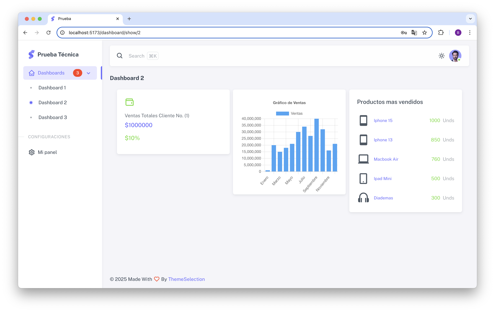

# FrontEnd - Vuejs 3- Dashboard

Este repositorio contiene el frontend del sistema de dashboards personalizados, desarrollado en **Vue 3** con **Vite**, **Pinia**, **Vuetify**, **Chart.js** y consumo de API protegida con JWT. Permite a los usuarios (clientes) autenticados visualizar, crear y editar sus dashboards personalizados.

# Tecnologías

- Template utilizado: Sneat Free, https://demos.themeselection.com/sneat-vuetify-vuejs-admin-template-free/demo/dashboard
- Vuejs 3, Composition API
- Vurtify 3
- Pinia
- Chartjs
- SweetAlert2
- Axios
- Vue 3 Grid layout

# Requisitos

- Node.js 18+
- Acceso a la API NestJS corriendo localmente

# Instalación 
- Clona el repositorio: git clone 
- Entra a la carpeta : 
- Instala las dependencias : npm install

# variables de entorno
- Crea un archivo .env en la raiz del proyecto con el siguiente contenido:

  VITE_API_URL=http://localhost:3000

# levantar el servidor

- npm run dev
- La aplicación se ejecutará en http://localhost:5173
- Importante tener habilitado enableCors el origin para evitar bloqueo cors de http://localhost:5173 en el archivo main.ts de la api de nestjs.
 

# Autenticación y Funcionamlidades

- Inicie sesión o registrese donde dice registarse
- Luego de iniciar sesión, se redirigira a mi panel, donde podrá ver los dashboards creados y la opción de crear o editar dashboards
- En la opción de crear dashboard, será redirigido a el panel con tres componentes (cada uno con información proveniente de la api de nestjs) que se dejan arrastrar por el usuario y asi definir su dashboard.
- En el menú hay una opción que dice dashboards. En este menú se cargan desde la base de datos los dashboards que el cliente ha creado anteriormente.

# Capturas de pantalla

